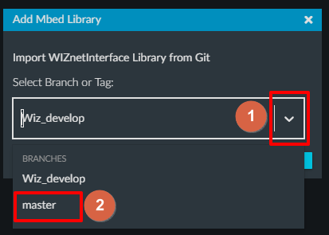

# mbed-os-example-socket with WIZnetInterface in mbed studio

## 프로그램 생성
 - main menu File -> New Program

<p align="center">
  
</p>

## 생성 후 바로 Build Program 

<p align="center">
  
</p>

## WIZnetInterface Library 추가

### git-hub 또는 mbed 사이트에서 주소 가져오기
 - mbed os site [WIZnetInterface](https://os.mbed.com/teams/WIZnet/code/WIZnetInterface-Mbed-OS-5-Library/)

<p align="center">
  
</p>

 - git-hub [WIZnetInterface](https://github.com/WIZnet-MbedEthernet/WIZnetInterface)

<p align="center">
  
</p>

 - Mbed Studio menu File -> Add Library to Active Program

<p align="center">
  
</p>

 - Add Mbed Library에 복사한 주소 넣기

<p align="center">
  
</p> 

 - Branch or Tag 선택

<p align="center">
  
</p> 

 - Master Branch 선택

<p align="center">
  
</p> 

- WIZnetInterface 추가 완료

<p align="center">
  
</p> 

## mbed_app.json File  수정
```
{
    "config": {
        "network-interface":{
            "help": "options are ETHERNET, ETHERNET_WIZNET",
            "value": "ETHERNET_WIZNET"
        }
    },
    "target_overrides": {
        "*": {
            "platform.stdio-baud-rate": 115200,
            "platform.stdio-convert-newlines": true,
            "mbed-trace.enable": 0
        }
    }
}
```

## WIZnetInterface 안의 mbed_lib.json 수정
```
{
    "name": "WIZNET",
    "config": {
        "sck": {
            "help": "sck pin for spi connection. defaults to SPI_SCK",
            "value": "SPI_SCK"
        },
        "cs": {
            "help": "cs pin for spi connection. defaults to SPI_CS",
            "value": "SPI_CS"
        },
        "miso": {
            "help": "miso pin for spi connection. defaults to SPI_MISO",
            "value": "SPI_MISO"
        },
        "mosi": {
            "help": "mosi pin for spi connection. defaults to SPI_MOSI",
            "value": "SPI_MOSI"
        },
        "rst": {
            "help": "RESET pin for spi connection. defaults to D15",
            "value": "D15"
        },
        "debug": {
            "help": "Enable debug logs. [true/false]",
            "value": false
        },
        "interface": {
            "help": "Set the wiznet module interface [W5500/W6100]",
            "value": "W5500"
        },
        "socket-bufsize": {
            "help": "Max socket data heap usage",
            "value": 8192
        },
        "default-network": {
            "help": "Set the default network interface",
            "options" : [true,false],
            "value": true
        }
    },
    "target_overrides": {
    }
}
```

## Build 및 프로그램 실행

<p align="center">
  
</p> 

## 결과 화면
- 테라텀 결과

```
Mbed OS Socket example
Mbed OS version: 5.12.3

IP address: 192.168.0.3
Netmask: 255.255.255.0
Gateway: 192.168.0.1
sent 56 [GET / HTTP/1.1]
recv 256 [HTTP/1.1 200 OK]
Done

```